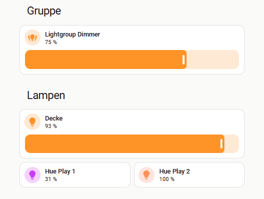
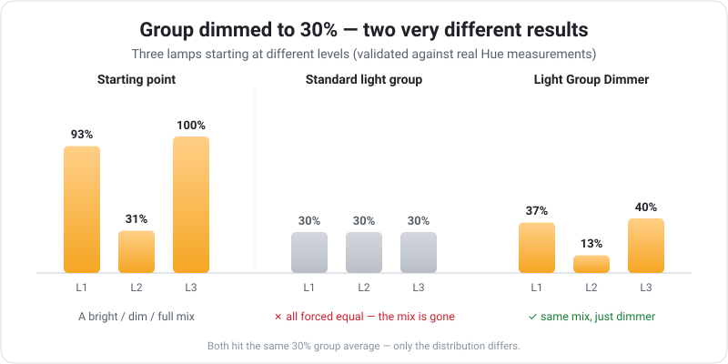

# Light Group Dimmer


<p align="center">
  <a href="https://github.com/xHecktor/light_group_dimmer">
    
  </a>
</p>

<p align="center">
  <a href="https://github.com/xHecktor/light_group_dimmer/releases"></a>
  <a href="https://github.com/xHecktor/light_group_dimmer/actions/workflows/validate.yml"></a>
  <a href="https://github.com/hacs/integration"></a>
  <a href="LICENSE"></a>
</p>

<p align="center">
  <a href="README.md">English</a> | <b>Deutsch</b>
</p>

**Light Group Dimmer** ist eine benutzerdefinierte Integration für [Home Assistant](https://www.home-assistant.io/), mit der du mehrere Lampen zu Gruppen zusammenfassen und gemeinsam dimmen kannst.

Diese Integration orientiert sich am Dimmverhalten von Hue und berücksichtigt, dass die Ausgangshelligkeit einzelner Lampen innerhalb einer Gruppe variieren kann. Beim Dimmen wird die Helligkeitsanpassung nicht gleichmäßig verteilt – Lampen, die bereits sehr hell sind, erhalten proportional weniger zusätzliche Helligkeit, während dunklere Lampen stärker angehoben werden. So bleibt die Lichtbalance in der gesamten Gruppe erhalten. Die Berechnung ist gegen reale Hue-Referenzmessungen getestet (siehe `tests/`).

In der Hue-App kann man durch Drücken und Halten des Schiebereglers experimentell die gewünschte Helligkeit einstellen. Da Home Assistant dieses „Drücken und Halten" nicht kennt, arbeitet die Integration mit einem **Delay**: Beim ersten Slider-Befehl wird die ursprüngliche Helligkeitsverteilung der Lampen zwischengespeichert. Alle weiteren Helligkeitsänderungen innerhalb des Delays rechnen auf dieser Original-Verteilung – du kannst also hoch- und wieder herunterdimmen und landest exakt beim Ausgangsbild. Der Delay misst dabei die **Ruhezeit nach dem letzten Slider-Befehl**; erst danach wird die aktuelle Verteilung zur neuen Ausgangsbasis.

Bitte beachtet, dass ich kein Programmierer bin und mir den Code in meiner Freizeit erarbeitet habe. Getestet wird primär mit einer Hue Bridge; die Integration nutzt aber ausschließlich die Standard-Licht-Services von Home Assistant und ist nicht auf Hue beschränkt.

## Warum gewichtetes Dimmen?

Ziehe den Gruppenregler, und die Mitgliedslampen behalten ihre relative Helligkeit (hier: 31 % / 93 % / 100 %), statt auf einen Wert zusammenzufallen:

<p align="center">
  
</p>

Eine normale Lichtgruppe setzt beim Ziehen des Reglers jede Lampe auf denselben Wert – die eingestellte Balance geht verloren. Light Group Dimmer skaliert die Lampen stattdessen proportional: Beide treffen denselben Gruppen-Mittelwert, aber nur die gewichtete Variante erhält den Charakter der Szene:

<p align="center">
  
</p>

## Inhalt

- [Features](#features)
- [Installation](#installation)
- [Konfiguration](#konfiguration)
  - [YAML-Konfiguration](#yaml-konfiguration)
  - [UI-Konfiguration (Config Flow)](#ui-konfiguration-config-flow)
- [Verwendung](#verwendung)
- [Tests](#tests)
- [Hinweise](#hinweise)
- [Beitrag leisten](#beitrag-leisten)
- [Lizenz](#lizenz)

## Features

- **Gruppensteuerung:** Fasse mehrere Lichtentitäten zu einer Gruppe zusammen und steuere sie gemeinsam. Geräte ohne Helligkeit (z. B. Smart Plugs) können Mitglied sein – sie schalten mit, werden beim Dimmen aber ignoriert.
- **Weighted Dimming:** Gewichtete Berechnung nach Hue-Vorbild – die Helligkeitsverhältnisse der Lampen bleiben beim Dimmen erhalten. Es werden nur Lampen berücksichtigt, die eingeschaltet sind.
- **Globaler Delay:** Ruhezeit nach dem letzten Slider-Befehl, in der die Original-Verteilung als Rechenbasis erhalten bleibt (Standard: 5 s).
- **Sofortige Reaktion:** Die Gruppe ist vollständig event-getrieben. Der Helligkeitsregler reagiert unmittelbar und springt beim Dimmen nicht durch Zwischenwerte.
- **Farbtemperatur in Kelvin:** Durchgängig `color_temp_kelvin` (HA-Standard); die Kelvin-Grenzen der Gruppe ergeben sich automatisch aus den Mitgliedern.
- **Übergangszeiten:** `transition:` aus Szenen, Automationen und Service-Aufrufen wird an die Lampen durchgereicht.
- **YAML und UI:** Gruppen und Delay per `configuration.yaml` oder über den Config Flow; UI-Gruppen lassen sich nachträglich umbenennen, ohne dass eine neue Entity entsteht.
- **Diagnose:** Unter *Geräte & Dienste → Light Group Dimmer → Diagnose herunterladen* gibt es einen JSON-Dump für Fehlerberichte.
- **Einschaltverhalten:** Beim reinen Einschalten stellt z. B. die Hue Bridge die letzten Lampenzustände wieder her. Wer alle Lampen mit gleicher Helligkeit einschalten will, stellt bei ausgeschalteter Gruppe direkt die Helligkeit über den Regler ein.

## Installation

Voraussetzung: Home Assistant ≥ 2024.12.

### Über HACS (empfohlen)

[](https://my.home-assistant.io/redirect/hacs_repository/?owner=xHecktor&repository=light_group_dimmer&category=integration)

oder manuell in HACS:

1. Stelle sicher, dass [HACS](https://hacs.xyz) installiert ist.
2. Füge in HACS das benutzerdefinierte Repository **xHecktor/light_group_dimmer** (Typ: **Integration**) hinzu.
3. Installiere **Light Group Dimmer** und starte Home Assistant neu.
4. Füge die Integration unter **Einstellungen → Geräte & Dienste** hinzu.

*Beta-Versionen:* In HACS beim Repository „Redownload" wählen und „Show beta versions" aktivieren.

### Manuell

1. Lade den Quellcode von [GitHub](https://github.com/xHecktor/light_group_dimmer) herunter.
2. Kopiere `custom_components/light_group_dimmer` in das `custom_components`-Verzeichnis deiner Home-Assistant-Konfiguration.
3. Starte Home Assistant neu.

## Konfiguration

### YAML-Konfiguration

```yaml
light_group_dimmer:
  delay: 5
  groups:
    - name: "Wohnzimmer Gruppe"
      entities:
        - light.wohnzimmer_decke_1
        - light.wohnzimmer_decke_2
    - name: "Schlafzimmer Gruppe"
      entities:
        - light.schlafzimmer_decke_1
        - light.schlafzimmer_decke_2
```

Wird YAML konfiguriert, hat der YAML-Delay Vorrang und der Master-Eintrag ist schreibgeschützt. YAML-Gruppen sind nicht über den UI-OptionsFlow änderbar; Änderungen an der YAML werden mit einem Neustart von HA wirksam.

### UI-Konfiguration (Config Flow)

- Beim ersten Start wird automatisch ein Master-Eintrag **„Global Delay Settings"** erstellt (globaler Delay). Er darf nur einmal existieren; die manuelle „master"-Option im Dialog dient nur als Backup, falls er gelöscht wurde.
- Neue Gruppen (Typ „group") werden über den Config Flow erstellt und über die Options im UI geändert (Name und Entitäten). Umbenennen erhält die Entity samt Historie und Automationen.
- YAML-Gruppen erscheinen gesammelt im Eintrag **„Imported from YAML"**.

## Verwendung

**Steuerung:** Die Gruppen erscheinen als normale Lichtentitäten und lassen sich über Dashboard, Automatisierungen und Sprachassistenten steuern – inklusive `transition:` in Service-Aufrufen.

**Dimmen:** Die gewichtete Dimmlogik verteilt Änderungen proportional. Der Delay-Timer startet mit jedem Helligkeitsbefehl neu; solange er läuft, rechnet die Gruppe auf der ursprünglichen Verteilung weiter (Hue-„Drücken-und-Halten"-Verhalten).

## Tests

Im Repository liegt ein vollständiges Testpaket:

- `tests/test_brightness.py` – Regressionstest der Dimm-Mathematik gegen 37 reale Hue-Referenzmessungen (läuft in der CI bei jedem Push).
- `docs/TESTPLAN.md` + `docs/test_scripts.yaml` – Skripte, die alle Testfälle direkt in Home Assistant durchfahren und die Ergebnisse in eine Datei schreiben.
- `tests/evaluate_results.py` – wertet diese Ergebnisdatei als Pass/Fail-Tabelle aus.

## Hinweise

- **±1–2 % Abweichung** zwischen kommandierten und angezeigten Werten sind normal (Umrechnung Prozent ↔ 0–255 plus Rundung der Lampen-Firmware).
- **Effekte:** Die Gruppe bietet die Vereinigung aller Mitglieds-Effekte an; Lampen, die einen gewählten Effekt nicht kennen, ignorieren ihn.
- **Dynamische Hue-Szenen** sind ein Bridge-Feature und werden über die Hue-Integration gestartet (`hue.activate_scene` mit `dynamic: true`); die Gruppe zieht die Lampenzustände automatisch nach.

## Beitrag leisten

Beiträge sind willkommen! Bitte reiche Pull Requests ein oder eröffne ein Issue, wenn du Fehler findest oder Features vorschlagen möchtest. Bei Fehlerberichten hilft der Diagnose-Download (s. o.) sehr.

## Lizenz

Dieses Projekt steht unter der MIT-Lizenz.
